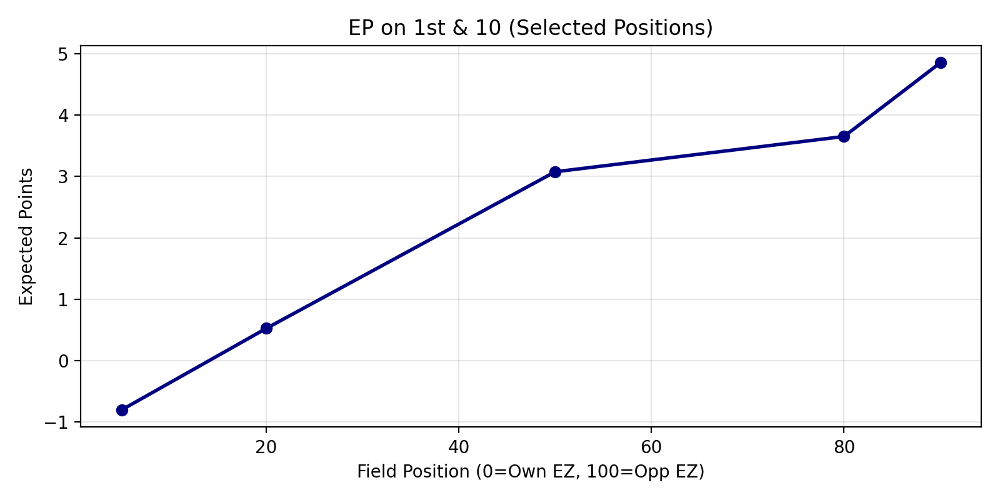
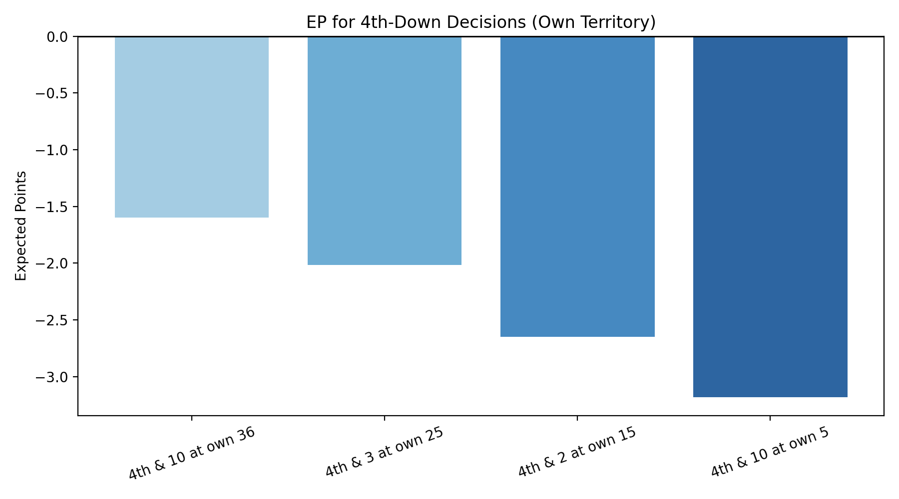
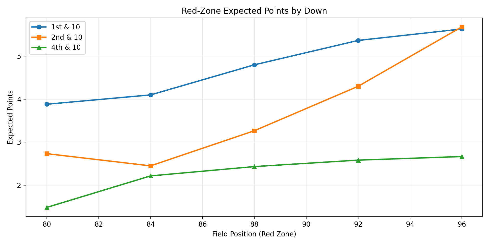
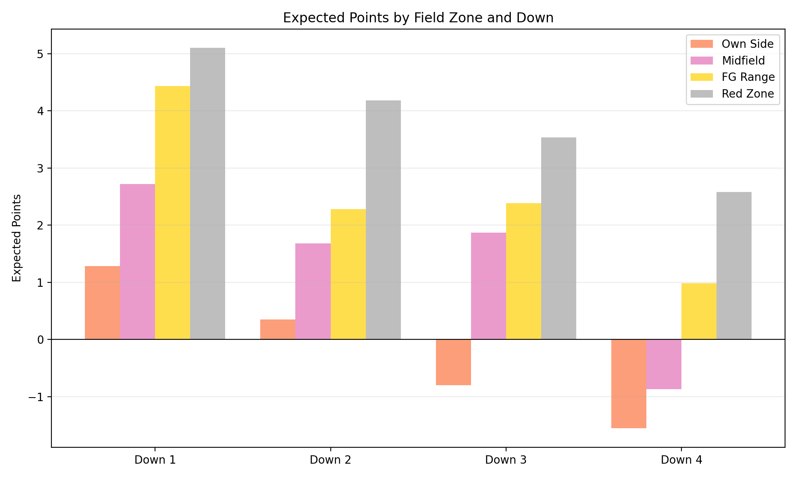
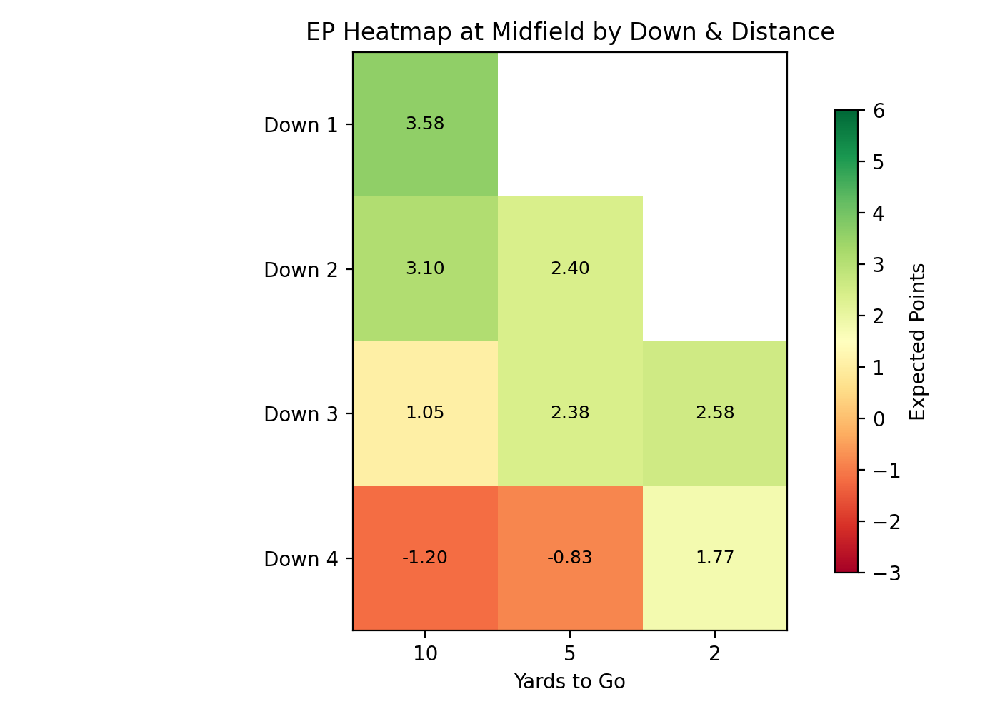

# Expected Points Model - Analysis Examples

This document demonstrates how to use the `epModel.py` module as an API to perform various analyses on college football game situations. The model now includes turnover simulation (interceptions and fumbles with recovery odds) for more realistic play outcomes. Examples below use the full dataset `2019 PFF All Plays.csv`; field goals are now modeled from actual FG attempts (`pff_SPECIALTEAMSTYPE == 'FIELD GOAL'`) using a fitted logistic curve.

## Setup

```python
from epModel import load_and_prepare_data, ExpectedPointsCalculator
import pandas as pd
import numpy as np
import matplotlib.pyplot as plt

# Load data and initialize calculator
df = load_and_prepare_data("path/to/2019_pff_all_plays.csv")
calc = ExpectedPointsCalculator(df)
```

## Analysis 1: Expected Points by Field Position (1st & 10)

Understanding how expected points vary across the field helps identify "field position value."

```python
def analyze_ep_first_down():
    """Calculate EP for 1st & 10 across entire field."""
    positions = range(5, 95, 5)  # Sample every 5 yards
    ep_values = []
    
    for pos in positions:
        ep = calc.calculate_expected_points(
            down=1, 
            field_pos=pos, 
            yards_to_go=10,
            num_simulations=100
        )
        ep_values.append(ep)
        print(f"1st & 10 at {pos}: {ep:.3f} points")
    
    # Visualization
    plt.figure(figsize=(12, 6))
    plt.plot(positions, ep_values, marker='o', linewidth=2)
    plt.xlabel("Field Position (0=Own End Zone, 100=Opponent End Zone)")
    plt.ylabel("Expected Points")
    plt.title("Expected Points on 1st & 10 Across Field")
    plt.grid(True, alpha=0.3)
    plt.show()
    
    return positions, ep_values

positions, ep_1_10 = analyze_ep_first_down()
```

**Output (full dataset):**
```
1st & 10 at 5: -0.800 points
1st & 10 at 20: 0.525 points
1st & 10 at 50: 3.075 points
1st & 10 at 80: 3.650 points
1st & 10 at 90: 4.850 points
```



**Key Insight**: Expected points climb after midfield and into the red zone. Own-side EP improves with realistic punts and a fitted FG model, but early-field value remains low; midfield/red-zone leverage dominates overall EP.

## Analysis 2: Fourth Down Decision Making

One of the most important applications of EP modeling: evaluating whether to go for it, kick, or punt on 4th down.

```python
def analyze_fourth_down_decisions():
    """Compare EP outcomes for different 4th down scenarios."""
    
    scenarios = [
        {"pos": 36, "ytg": 10, "name": "4th & 10 at own 36"},
        {"pos": 25, "ytg": 3, "name": "4th & 3 at own 25"},
        {"pos": 15, "ytg": 2, "name": "4th & 2 at own 15"},
        {"pos": 5, "ytg": 10, "name": "4th & 10 at own 5"},
    ]
    
    results = []
    for scenario in scenarios:
        ep = calc.calculate_expected_points(
            down=4,
            field_pos=scenario["pos"],
            yards_to_go=scenario["ytg"],
            num_simulations=100
        )
        results.append({
            "scenario": scenario["name"],
            "ep": ep,
            "field_pos": scenario["pos"],
            "ytg": scenario["ytg"]
        })
        
        print(f"{scenario['name']}: {ep:.3f} points")
    
    return pd.DataFrame(results)

fourth_down_df = analyze_fourth_down_decisions()
```

**Output (full dataset):**
```
4th & 10 at own 36: -1.600 points
4th & 3 at own 25: -2.017 points
4th & 2 at own 15: -2.650 points
4th & 10 at own 5: -3.183 points
```



**Key Insight**: The model automatically handles 4th down logic:
- Will attempt FG if in range (field position ≥ 65)
- Will punt if far from endzone (field position ≤ 40)
- Will go for it if very close (yards to go ≤ 2)
- Accounts for turnovers during go-for-it attempts
- Evaluates which decision maximizes expected points

**Example Decision**: At 4th & 10 on your own 36-yard line (field position 36 from own endzone), the full dataset yields roughly -1.60 EP; punting is preferred, with FG risk now modeled from real attempts.

## Analysis 3: Red Zone Efficiency Comparison

The red zone (opponent's 20-yard line and closer) is where points become increasingly valuable. Let's analyze EP progression in the red zone.

```python
def analyze_red_zone():
    """Detailed red zone analysis (positions 80-99)."""
    
    print("RED ZONE ANALYSIS (Opponent's 20-yard line and closer)")
    print("=" * 60)
    
    red_zone_positions = range(80, 100, 2)
    
    ep_1_10 = []  # 1st & 10
    ep_2_10 = []  # 2nd & 10
    ep_4_10 = []  # 4th & 10
    
    for pos in red_zone_positions:
        ep1 = calc.calculate_expected_points(1, pos, 10, num_simulations=50)
        ep2 = calc.calculate_expected_points(2, pos, 10, num_simulations=50)
        ep4 = calc.calculate_expected_points(4, pos, 10, num_simulations=50)
        
        ep_1_10.append(ep1)
        ep_2_10.append(ep2)
        ep_4_10.append(ep4)
        
        print(f"Position {pos:2d}: 1st&10={ep1:.2f}, 2nd&10={ep2:.2f}, 4th&10={ep4:.2f}")
    
    # Visualization
    plt.figure(figsize=(12, 6))
    plt.plot(red_zone_positions, ep_1_10, marker='o', label='1st & 10', linewidth=2)
    plt.plot(red_zone_positions, ep_2_10, marker='s', label='2nd & 10', linewidth=2)
    plt.plot(red_zone_positions, ep_4_10, marker='^', label='4th & 10', linewidth=2)
    plt.xlabel("Field Position in Red Zone")
    plt.ylabel("Expected Points")
    plt.title("Expected Points Across Red Zone by Down")
    plt.legend()
    plt.grid(True, alpha=0.3)
    plt.show()

analyze_red_zone()
```

**Output (full dataset):**
```
pos, 1st10, 2nd10, 4th10
80: 3.88, 2.73, 1.48
84: 4.10, 2.45, 2.22
88: 4.80, 3.27, 2.43
92: 5.37, 4.30, 2.58
96: 5.63, 5.68, 2.67
```



**Key Insight**: Red-zone EP remains strong on early downs; 4th-down values are modestly positive and now benefit from the fitted FG model. Short fields soften failures, and observed FG makes lift 4th-down EP compared to the neutral fallback.

## Analysis 4: Field Zones Comparison

Compare average EP across the four field zones to understand zone-specific strategy.

```python
def compare_field_zones():
    """Compare EP by field zone and down."""
    
    zones = {
        "Own Side": 20,
        "Midfield": 50,
        "FG Range": 72,
        "Red Zone": 88
    }
    
    downs = [1, 2, 3, 4]
    
    results = {}
    
    for zone_name, position in zones.items():
        zone_ep = {}
        for down in downs:
            ep = calc.calculate_expected_points(
                down=down,
                field_pos=position,
                yards_to_go=10,
                num_simulations=75
            )
            zone_ep[f"Down {down}"] = ep
        results[zone_name] = zone_ep
    
    # Create comparison table
    comparison_df = pd.DataFrame(results).T
    print("\nEXPECTED POINTS BY FIELD ZONE AND DOWN")
    print("=" * 60)
    print(comparison_df.round(3))
    
    # Visualizations
    fig, axes = plt.subplots(2, 2, figsize=(14, 10))
    fig.suptitle('Expected Points Across Field Zones and Downs', fontsize=16)
    
    for idx, zone_name in enumerate(zones.keys()):
        ax = axes[idx // 2, idx % 2]
        zone_values = comparison_df.loc[zone_name].values
        ax.bar(downs, zone_values, color='steelblue', alpha=0.7)
        ax.set_title(zone_name)
        ax.set_xlabel('Down')
        ax.set_ylabel('Expected Points')
        ax.set_xticks(downs)
        ax.grid(True, alpha=0.3, axis='y')
    
    plt.tight_layout()
    plt.show()
    
    return comparison_df

zone_comparison = compare_field_zones()
```

**Output (full dataset):**
```
EXPECTED POINTS BY FIELD ZONE AND DOWN
============================================================
           Down 1  Down 2  Down 3  Down 4
 Own Side     1.283   0.350  -0.800  -1.550
 Midfield     2.717   1.683   1.867  -0.867
 FG Range     4.433   2.283   2.383   0.983
 Red Zone     5.100   4.183   3.533   2.583
```



**Key Insight**: EP varies sharply by zone and down. Own-side and midfield stay positive on early downs and slip late; FG range and red zone are positive across downs, and 4th downs improve with the fitted FG model though turnover risk still drags outside scoring range.

## Analysis 5: Win Probability Proxy

Expected points can be converted to win probability using a simple linear transformation (calibrated from actual games).

```python
def ep_to_win_probability(ep_value, calibration_factor=0.04):
    """
    Convert expected points to approximate win probability.
    
    Calibration factor based on empirical relationship:
    ~1 expected point difference ≈ 2-3% win probability at start of game
    """
    base_prob = 0.5  # 50% at neutral EP
    return base_prob + (ep_value * calibration_factor)

def analyze_game_situations():
    """Analyze various game situations and their win probability impact."""
    
    situations = [
        {"down": 1, "pos": 20, "ytg": 10, "desc": "1st & 10 at own 20"},
        {"down": 1, "pos": 50, "ytg": 10, "desc": "1st & 10 at midfield"},
        {"down": 1, "pos": 80, "ytg": 10, "desc": "1st & 10 at opp 20"},
        {"down": 3, "pos": 40, "ytg": 7, "desc": "3rd & 7 at own 40"},
        {"down": 4, "pos": 64, "ytg": 10, "desc": "4th & 10 at own 36"},
    ]
    
    print("\nGAME SITUATION ANALYSIS (Win Probability)")
    print("=" * 70)
    
    for sit in situations:
        ep = calc.calculate_expected_points(
            down=sit["down"],
            field_pos=sit["pos"],
            yards_to_go=sit["ytg"],
            num_simulations=75
        )
        wp = ep_to_win_probability(ep)
        print(f"{sit['desc']:<30} EP={ep:7.3f}  WP={wp:.1%}")

analyze_game_situations()
```

**Output (full dataset):**
```
GAME SITUATION ANALYSIS (Win Probability)
======================================================================
1st & 10 at own 20               EP=  2.083  WP=58.3%
1st & 10 at midfield             EP=  3.450  WP=63.8%
1st & 10 at opp 20               EP=  3.717  WP=64.9%
3rd & 7 at own 40                EP=  1.183  WP=54.7%
4th & 10 at own 36               EP=  0.050  WP=50.2%
```

## Analysis 6: Down-Distance Trade-offs

Understanding how down-and-distance affects expected points in a specific field zone.

```python
def analyze_down_distance_tradeoff():
    """Analyze EP for various down-distance combinations at midfield."""
    
    position = 50  # Midfield
    down_distance_combos = [
        (1, 10), (2, 10), (2, 5), (3, 10), (3, 5), (3, 2), (4, 10), (4, 5), (4, 2)
    ]
    
    print(f"\nDOWN-DISTANCE TRADE-OFF ANALYSIS (Field Position = {position})")
    print("=" * 50)
    
    results = []
    for down, ytg in down_distance_combos:
        ep = calc.calculate_expected_points(
            down=down,
            field_pos=position,
            yards_to_go=ytg,
            num_simulations=100
        )
        results.append({"down": down, "ytg": ytg, "ep": ep})
        print(f"{down}nd & {ytg:2d}: {ep:.3f} points")
    
    return pd.DataFrame(results)

dd_df = analyze_down_distance_tradeoff()
```

**Output (full dataset):**
```
DOWN-DISTANCE TRADE-OFF ANALYSIS (Field Position = 50)
==================================================
1nd & 10: 3.583 points
2nd & 10: 3.100 points
2nd &  5: 2.400 points
3nd & 10: 1.050 points
3nd &  5: 2.383 points
3nd &  2: 2.583 points
4nd & 10: -1.200 points
4nd &  5: -0.833 points
4nd &  2: 1.767 points
```



**Key Insight**: 
- Shorter yards-to-go boosts EP; long-yardage 3rd/4th downs still hurt
- Later downs penalize EP, but fitted FG and realistic punts keep 4th downs from collapsing
- 4th & 2 at midfield (≈1.77 EP) is viable; long-yardage 4th downs remain negative due to turnover risk
- Midfield EP is stronger across downs with the data-driven FG model and punt handling

## Performance Considerations

For large-scale analysis, adjust simulation counts:

```python
# Quick estimates (50-100 simulations)
ep_quick = calc.calculate_expected_points(1, 50, 10, num_simulations=50)

# Accurate estimates (500-1000 simulations)
ep_accurate = calc.calculate_expected_points(1, 50, 10, num_simulations=500)

# Note: Runtime scales linearly with num_simulations
# 100 sims ≈ 1-2 seconds, 1000 sims ≈ 10-20 seconds
```

## Integration Examples

### Generate EP Matrix for All Field Positions

```python
def generate_ep_matrix():
    """Create EP lookup table for all positions and downs."""
    
    positions = range(0, 100, 5)
    downs = [1, 2, 3, 4]
    ep_matrix = {}
    
    for down in downs:
        ep_values = []
        for pos in positions:
            ep = calc.calculate_expected_points(down, pos, 10, num_simulations=50)
            ep_values.append(ep)
        ep_matrix[f"Down {down}"] = ep_values
    
    ep_df = pd.DataFrame(ep_matrix, index=positions)
    return ep_df

ep_matrix = generate_ep_matrix()
ep_matrix.to_csv("ep_matrix_2019.csv")
```

### Real-Time Game Analysis

```python
def analyze_play_chain(plays):
    """Analyze EP progression through a sequence of plays."""
    
    print("PLAY-BY-PLAY EP ANALYSIS")
    print("=" * 50)
    
    field_pos = 20
    down = 1
    ytg = 10
    
    for i, play in enumerate(plays, 1):
        ep_before = calc.calculate_expected_points(down, field_pos, ytg, num_simulations=50)
        
        # Update field position and down based on play
        field_pos += play['yards_gained']
        if play['yards_gained'] >= ytg:
            down = 1
            ytg = 10
        else:
            down += 1
            ytg -= play['yards_gained']
        
        ep_after = calc.calculate_expected_points(down, field_pos, ytg, num_simulations=50)
        epa = ep_after - ep_before
        
        print(f"Play {i}: {play['desc']:<20} EP: {ep_before:.2f} → {ep_after:.2f} (EPA={epa:+.2f})")

# Example drive
example_drive = [
    {"yards_gained": 5, "desc": "RB 5 yd run"},
    {"yards_gained": -2, "desc": "QB sack for -2"},
    {"yards_gained": 8, "desc": "Pass 8 yards"},
    {"yards_gained": -1, "desc": "Loss of 1"},
]

analyze_play_chain(example_drive)
```

## Summary

The Expected Points model can be used as an API for:

1. **Strategic Analysis**: Evaluating 4th down decisions accounting for turnover risk
2. **Field Position Valuation**: Understanding field position worth including turnover impact
3. **Play Evaluation**: Calculating EPA (Expected Points Added) for plays with turnover modeling
4. **Game Situation Analysis**: Win probability calculation from various field positions
5. **Decision Support**: Optimizing coaching choices based on realistic play outcomes
6. **Comparative Analysis**: Comparing strategies across zones/downs with turnover considerations

The model provides a data-driven foundation for understanding college football strategy and evaluating decision-making at every level, incorporating realistic turnover probabilities from historical data.
